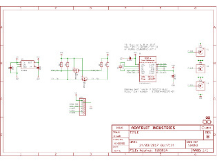

[//]: # (Table-A with 3-columns/5-lines, table-B with 2-columns/1-line)

<b> 
 Si5351 Oscillator Board met  Bidirectionele Dual I2C Isolator:
</b>

 | 
 | 

--- | --- | ---
 Si5351 oscillator board | board layout | schema Si5351 board
 |  | 
 |   | 
I2C isolator board.  | board layout | schema dual I2C isolator

 | 
---- | ----

Het AdaFruit Si5351 oscillator-board is in een massief messing blok gemonteerd en dit word op de messing afscherming van de verzwakker print geschroefd. 
Aan de achterkant van de oscillator-module is het I2C Isolator board gemonteerd. 
Om hf-lekkage te vermijden is dit board van eigen DC-DC converter voorzien. De I2C isolatie is met een <a href="Si5351+interface/ADUM1250_1251.pdf"> ADUM1250 </a> isolatorIC .
 
De oscillator module word met een bandkabel op de besturingsprint aangesloten.

Met een semi-rigid RG402 coax-kabel is de oscillator module op de verzwakker module aangesloten.
Daardoor kan het signaal niet via I2C, voedings leiding of door een niet volledig hf-dichte coax naar buiten lekken.
Op deze manier is het mogelijk om het signaal tot -145dBm te verzwakken.

[//]: # (This may be the most platform independent comment)
[//]: # (see also https://webapps.stackexchange.com/questions/29602/markdown-to-insert-and-display-an-image-on-github-repo)

