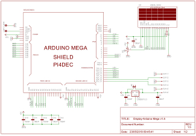
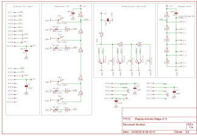
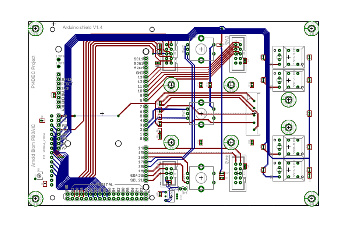
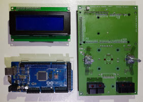

[//]: # (Table with 3-columns/7-lines)

##BESTURINGS PRINT :

De Besturingsprint is een 4-laags PCB. 
De signaal verbindingen liggen opgesloten tussen een massa vlak en een Vcc vlak, zodat stoorstraling geminimaliseerd wordt.

 | **+** |  
--------------------------------------------- | --- |  -----------------------------------------------
**ArduinoMega2560 + Display + I2C-connector** |     | **Drukknoppen + Rotary schakelaars + connectors**
  |     |  
  |     | 
  |     | 
 |**-** | 
  **PCB layout** *( inner layers )* |     |   **componenten v/d besturingsprint**
  
**Headers :** voor een full-size Arduino Mega 2560

**Header  :** voor een Display LCD2004

**Boxed Headers :**
<ul>
  <li> SV1 :  6-polig connector (sda-scl) + voeding voor dual I2C isolator board  </li>
  <li> SV2 : 10-polig connector + voeding van SPI-bus </li>
  <li> SV3 : 10-polig data stuursignaal verzwakker print </li>
  <li> SV4 : 10 polig latch stuursignaal verzwakker print </li>
</ul>

**Schakelaars :**
<ul>
    <li> tact-switches:  S6, S7, S8 en S9  met Led's </li>
    <li> rotary-swiches: SW1 en SW2  met drukschakelaar S1 en S2 </li>
</ul>

