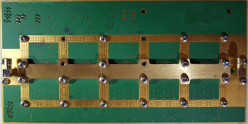

## VERZWAKKER PRINT :

 |     |     
--------------------------------------------- | --- |  --------------------------------------------
**5x Digitale stap verzwakker** | **Board layout**  | **Power Supply verzwakker**
|  | 
|  |

De verzwakker module bestaat uit 5 identieke deelverzwakkers. Iedere deelverzwakker bestaat uit een   digitale stap verzwakkers van Mini Circuits met daarbij behorende stuur logica. Ieder IC met componenten zit op het PCB in een eigen omgeving. Als afscherming dienen twee uitgefreezde messing platen die boven en onder over de PCB gemonteerd worden. Daardoor ontstaan 5 kleine rf-dichte kamertjes. De koppeling tussen de 5 verzwakkers gebeurt met kleine stukjes 50 ohm RG402 kabel.

 |    

Een enkele verzwakker is 6-bit met een resolutie van 0.5dB, zodat per chip max -31.5dB is in te stellen. Met 5 deelverzwakkers in serie kan zodoende maximaal -157.5dB ingesteld worden. In de praktijk blijkt dat de bruikbare grens bij 145dB verzwakking ligt. Dit wordt veroorzaakt doordat een zeer klein deel van het rf-signaal toch weg kan lekken

De verzwakker kan tot minstens 3000 MHz goed werken. Voor de meetzender ligt de praktische grens iets boven 1000 MHz.
Dit komt door de schakeltijden in de Si5351 oscillator die een blokgolf produceerd waarbij harmonischen worden gebruikt om boven 150 Mhz te komen. De 150 MHz wordt bepaald door de etherkit library, die boven 150 MHz onvoorspelbaar gedrag vertoond, de Si5351 chip zelf kan tot ca. 250 MHz stabiele signalen geven
