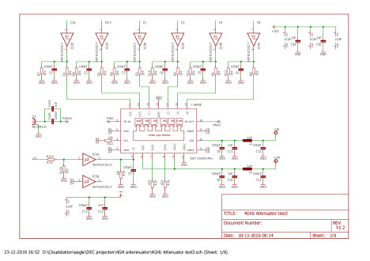
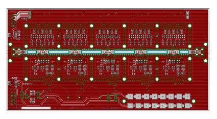
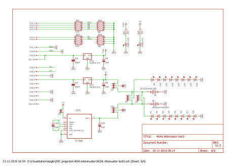
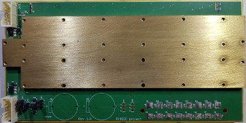

<b> 
 VERZWAKKER PRINT :
</b>

 |     |     
--------------------------------------------- | --- |  --------------------------------------------
**5x Digitale stap verzwakker** | **Board layout**  | **Power Supply verzwakker**
|  | 
|  |

De Verzwakker print is een 4-laags PCB zodat alle schakel- en rf-printsporen opgesloten liggen tussen twee massa vlakken.

 |    

De verzwakker module bestaat uit 5 stuks <a href="verzwakker_print/DAT-31R5A-PN.pdf">DAT-31R5A-PN</a> digitale stap verzwakkers van Mini Circuits in serie. Ieder IC met bijbehorende componenten zit op het PCB in een eigen omgeving. Als afscherming dienen twee uitgefreezde messing platen die boven en onder over de PCB gemonteerd worden. Daardoor ontstaan 5 kleine rf-dichte kamertjes. De koppeling tussen de 5 verzwakkers gebeurt met kleine stukjes 50 ohm RG402 kabel.

Een enkele verzwakker is 6-bit met een resolutie van 0.5dB, tot max -31.5dB instelbaar.
Hiermee kan maximaal -157.5dB ingesteld worden. In de praktijk blijkt de grens bij 145dB verzwakking ligt.

